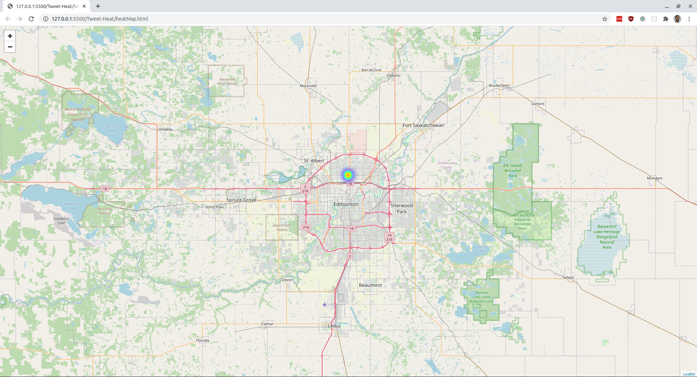

# Tweet Heat



Our program crawls through Twitter data and receives live tweets from all over North America. 
Of all these tweets collected, roughly 10 percent of have location data with it. The program then puts all of 
these latitude and longitude coordinate points on a map, and generates a heat map where in the highest traffic 
locations around North America. 

## Installation

First install the right dependencies:
```bash
python3 -m pip install tweepy
python3 -m pip install folium
```

Then you need to run these two apps in seperate terminals:
```bash
python3 mapGen.py
python3 stream_twitter.py
```

Finally open heatMap.html using a live server. We used the VS code extension during development I think:
https://marketplace.visualstudio.com/items?itemName=ritwickdey.LiveServer